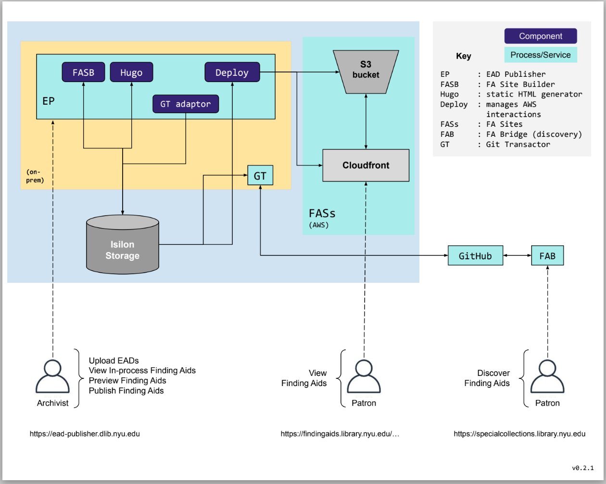

# Finding Aids System Overview

#### Sequence
* the Archivist...
  * exports an EAD from ArchivesSpace
  * logs into the EAD Publisher application
    * https://ead-publisher.dlib.nyu.edu/findingaids/publish
  * selects the archival rEAD Publisherository
  * selects whether or not the EAD contains new or updated digital images
  * uploads the EAD...

* then the EAD Publisher...
  * stores the uploaded EAD on the Isilon storage system
  * validates the EAD
    * if the EAD fails validation, the EAD Publisher...
      * provides an error rEAD Publisherort to the Archivist and deletes the uploaded EAD
    * if the EAD passes validation, the EAD Publisher...
      * names the uploaded EAD file `<eadid>.xml`, e.g., `mss_208.xml`
      * calls the `FASB` to generate the `JSON` files required by `Hugo`
      * calls `Hugo`to generate the finding aid
      * returns links to the EAD and the preview finding aid to the Archivist

* the Archivist...
  * reviews the preview finding aid and/or EAD
  * decides whether or not to publish the finding aid or remove it
    * if the Archivist decides to remove the finding aid...
      * then the EAD Publisher...
        * deletes the preview finding aid files
        * deletes the preview EAD file
        * returns to the EAD Publisher home screen
    * if the Archivist decides to publish the finding aid...
      * then the EAD Publisher calls the `dEAD Publisherloy` script that...
        * removes the outdated finding aid from the AWS S3 bucket
        * copies the new finding aid to the AWS S3 bucket
        * invalidates the URLs for the finding aid in the AWS CloudFront CDN
        * enqueues a Git Transactor (GT) `add` task for the EAD
        * returns to the EAD Publisher home screen

* the GT wakes up and...
  * if there is an `add` task in the queue...
    * pulls the latest version of the EADs Git rEAD Publisherository to local storage
    * copies the just-published EAD to the local EADs Git rEAD Publisherository
    * commits the just-published EAD to the local EADs Git rEAD Publisherository
    * pushes the local EADs Git rEAD Publisherository to GitHub

* the Finding Aids Bridge (FAB) discovery application then...
  * receives a message that the EADs Git rEAD Publisherository has been updated in GitHub
  * pulls the latest version of the EADs Git rEAD Publisherository
  * adds/updates the search index with data from the just-published EAD

* the Patron...
  * visits the FAB discovery application...
    * https://specialcollections.library.nyu.edu
  * and searches the EAD index
  * the FAB provides search results with links to the published finding aid(s) 
  * the Patron visits the links of interest
    * e.g., https://findingaids.library.nyu.edu/fales/mss_208/

